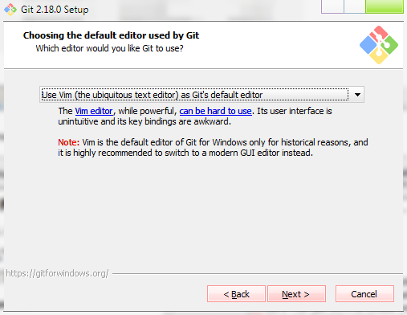
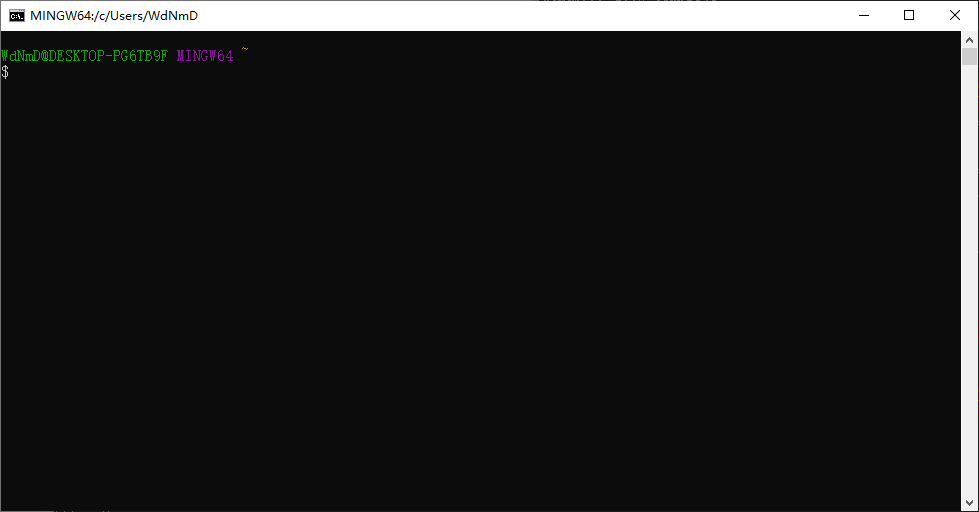
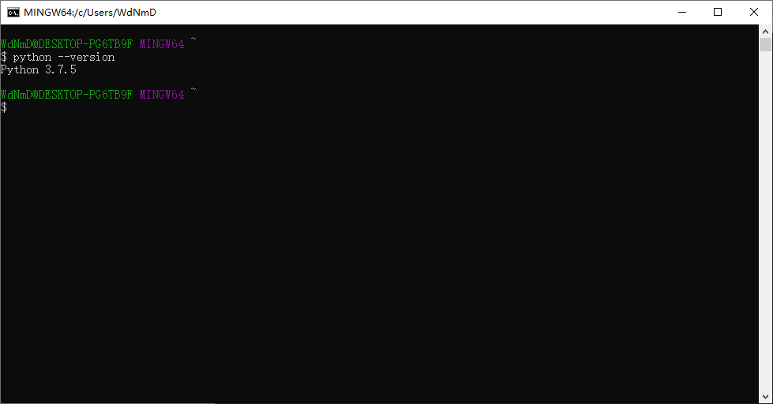
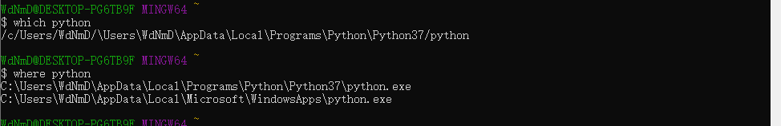
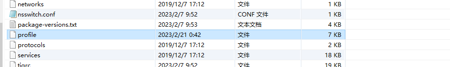
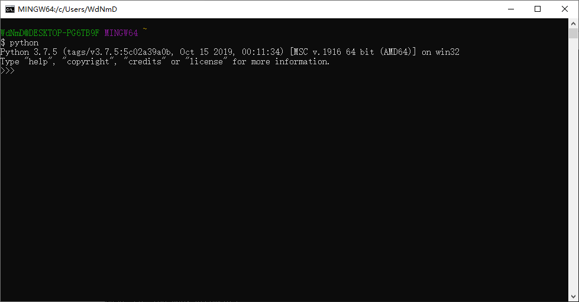
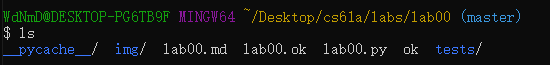
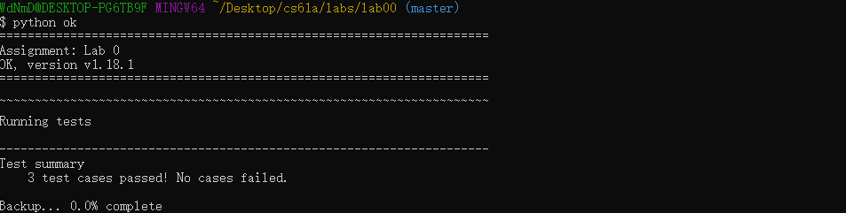
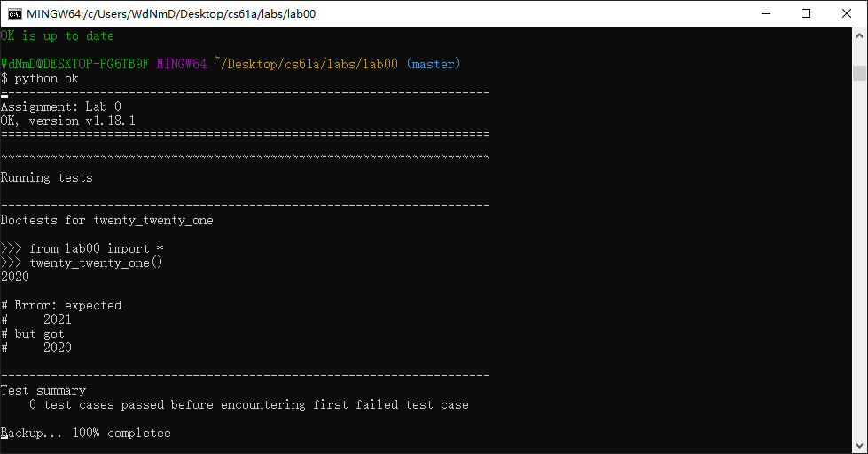
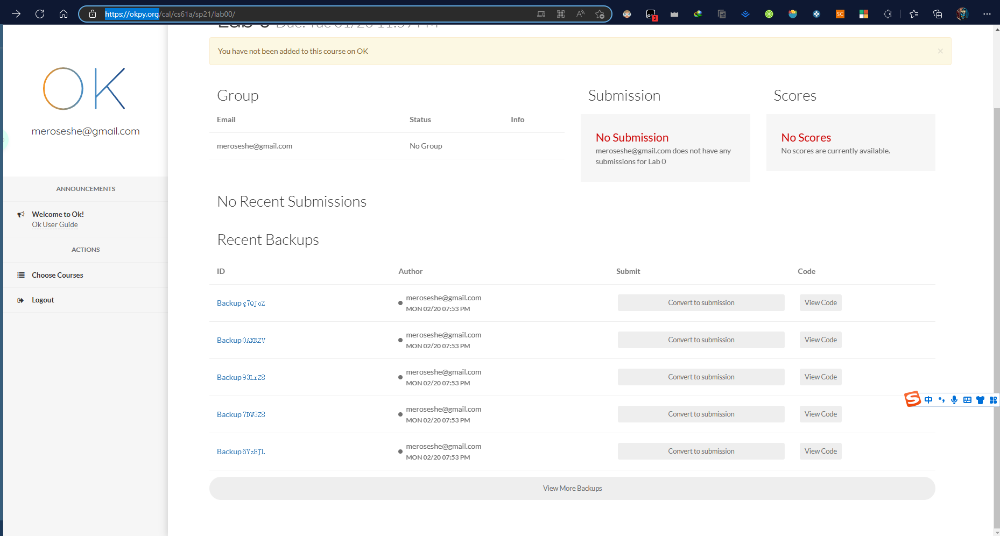

# Lab 0: Getting Started

本实验是一个引导性实验，着重在于环境的配置与本地测试机的使用，**强烈建议认真动手做一遍！！**

原文连接：[Lab 0: Getting Started | CS 61A Spring 2021 (berkeley.edu)](https://inst.eecs.berkeley.edu/~cs61a/sp21/lab/lab00/)，有能力的可以阅读原文教程

[toc]

## 安装命令行工具

CS61A大多实验与工具都需要在命令行终端中运行，如果是MacOS或者Linux(Ubuntu)等系统，跳过这步，由于打开虚拟机略显复杂我这里选择使用GitBash工具(Windows自带的PoweShell也可以用，不过Powershell界面不太讨喜并且使用gitbash便于上传到自己的仓库中)

下载地址：[Git - Downloading Package (git-scm.com)](https://git-scm.com/download/win)

相关配置教程：[GitHub教程 Git Bash详细教程_云想衣裳，花想容的博客-CSDN博客_git bash](https://blog.csdn.net/weixin_41087220/article/details/118099800)

进入安装程序，这里选择编辑器默认使用vim，我这里建议使用VSCode，vim对于Windows来说有些古老并且用户界面引导较少，课程中也是推荐使用vscode




后面的都可以使用默认设置,到下面一步选择**Use Windows' default console window**,否则你的终端无法交互式运行Python


安装完成，进入GitBash



## 安装Python

这里由于我已经安装了python并且加入到环境变量中，不再赘述

运行命令

```bash
$python --version
```



### 没有选择MinTTY仍然无法运行python的解决办法

如果你在安装GitBash时选择了**Use Windows' default console window**并且此前已经安装好了python，但是输入*“python --version”“python2/3”*等命令仍然无法使用或者跳出微软商店的python安装界面，你可以采用以下办法解决

首先在GitBash中键入以下命令

```bash
$ where python  (查找电脑中是否存在python.exe)
$ which python	(查找gitbash指定的python)
```

一般来说第二个命令的结果应该与第一个命令结果一致，如下图。但是错误情况下*which python*的结果会指向微软商店的文件夹



下面是一个简单粗暴的解决办法：直接将已有的python路径加入到git中

进入以下路径

```bash
$ cd C:\Program Files\Git\etc
```

以管理员权限修改**profile**文件



在文件末尾加入以下代码，path是你自己python的安装目录

```D
export PATH="path:$PATH"
```

保存文件并重启GitBash，测试(这里不要输入python2/3带版本号的，直接输入python，前者还是会跳转到微软商店)



## 开始实践

### 测试

这里假定熟悉命令行的基本操作并且已经下载解压实验资料



lab00.py是你要在其中编写代码的文件(不要新建文件或更改名字)，**ok**与**lab00.ok**是本地测试机，用来对编写的代码测试正确性

输入以下命令

```bash
$ python ok -q python-basics -u
```

```bash
>>> 10 + 2
?______

>>> 7 / 2
?______

>>> 7 // 2
?______

>>> 7 % 2		  # 7 modulo 2, equivalent to the remainder of 7 // 2
```

回答一些简单的数学问题，直接输入正确答案

### 代码编写

在vscode中打开lab00.py(或者直接在gitbash中使用 start lab00.py)

```python
def twenty_twenty_one():
    """Come up with the most creative expression that evaluates to 2021,
    using only numbers and the +, *, and - operators.

    >>> twenty_twenty_one()
    2021
    """
    return ____

```

注释部分描述了该程序所要求实现的功能与测试时的调用方法

注释外则是你要编写的代码部分，这里的要求是程序输出数字2021

编写完毕，回到git中，输入以下命令进行测试

```bash
$ python ok
```



如果通过测试则如上图所示，如果没有通过，在终端中会输出错误的部分



在首次进行测试时，会要求你输入edu邮箱账号，直接回车，如果你开了梯子，这时会跳转到https://okpy.org/的网站，注册一个账号，在这个网站上可以看到你每次运行测试时自动提交的代码。由于我们现在已经不在正式上课的时间，所以不会记录成绩

