[toc]


# Phase 1：Simulator

## Problem 0

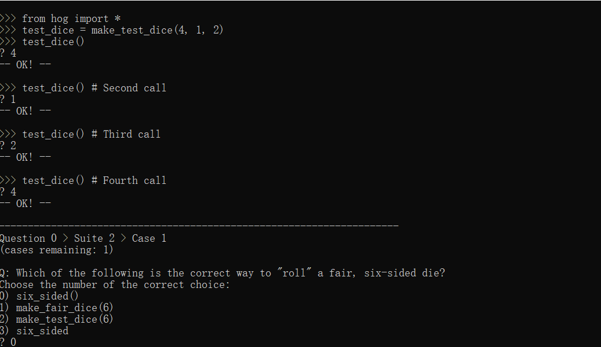

```bash
>>from hog import *
>>test_dice make_test_dice(4,1,2)
>>test dice()
?
```

## Prob 1

```bash
>>> from hog import *
>>> roll_dice(4, make_test_dice(2, 2, 3))
?
# num_roll

>>> from hog import *
>>> counted_dice = make_test_dice(4, 1, 2, 6)
>>> roll_dice(3, counted_dice)
?
>>> roll_dice(1, counted_dice)
?

>>> roll_dice(7, make_test_dice(2, 2, 2, 2, 2, 2, 1))
?
```

## Prob 2

实现`Piggy_Points`，它获取对手的当前分数并返回掷0骰子所得的点数

点数按照以下规则计算：

> 选择掷零骰子的玩家得到 k + 3分，其中 k 是平方对手得分中值最低的数字
>
> 例如，玩家1选择掷0骰子，玩家2当前得分5分，5*5=25，其中最小的数字为2，那么玩家1本轮获得2+3=5分

## Prob 3

实现 `take _ turn` 函数，该函数通过滚动给定的骰子 `num _ rolls` 次数来返回每回合得分的点数。`take _ turn` 的实现应该在可能的情况下同时调用 `roll _ dice`和 `Piggy _ points`

## Prob 4

实现 `More _ Boar`，它获取当前玩家和对手的得分，并返回当前玩家是否会因为 `More Boar` 而进行另一个回合，如果需要进行额外一次返回`True`，否则返回`False`

More Boar的规则如下：

> 首先计算当前回合当前玩家的得分，并加入到该玩家的总得分中。如果当前玩家总得分的最左侧数字小于对手得分的最左侧数字，并且第二左侧数字小于对手的第二左侧数字，那么当前玩家再额外进行一轮投骰子。如果得分仅为个位数，可以将它高位补零，如8->08
>
> 例如玩家1本轮得分8分，之前总分13分，则本回合过后总分为21分，对手为43分，那么有2<4且1<3，玩家1再额外投一次骰子

## Prob 5

```bash
>>> import hog
>>> always_three = hog.make_test_dice(3)
>>> always = hog.always_roll
>>> #
>>> # Play function stops at goal
>>> s0, s1 = hog.play(always(5), always(3), score0=91, score1=10, dice=always_three)
>>> s0
?
>>> s1
?

>>> import hog
>>> always_three = hog.make_test_dice(3)
>>> always_seven = hog.make_test_dice(7)
>>> #
>>> # Use strategies
>>> # We recommend working this out turn-by-turn on a piece of paper (use Python for difficult calculations).
>>> strat0 = lambda score, opponent: opponent % 10
>>> strat1 = lambda score, opponent: max((score // 10) - 4, 0)
>>> s0, s1 = hog.play(strat0, strat1, score0=71, score1=80, dice=always_seven)
>>>
```

这次需要完整的编写`play`函数，模拟一整局游戏

```python
def play(strategy0, strategy1, score0=0, score1=0, dice=six_sided,
         goal=GOAL_SCORE, say=silence)
"""
    strategy0: 	玩家0的策略函数，这个函数接收当前玩家与对手的得分作为参数，返回当前玩家在本轮中投掷的骰子数.
    strategy1:  玩家1的策略函数
    score0:     玩家0的初始得分，默认参数为0
    score1:     玩家1的初始得分，默认参数为0
    dice:       骰子函数，模拟投掷骰子的过程，随机返回一个范围内的正整数
    goal:       游戏结束的条件，默认参数为GOAL_SCORE=100
    say:        注释函数.
"""
```

采用循环事件来模拟游戏，每次循环作为任意玩家投掷一次骰子的过程，这里还需要考虑到`More Boar`规则的限制

# Phase 2：Commentary

## Prob 6

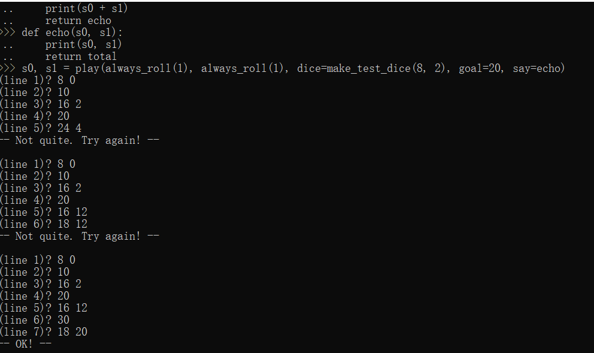

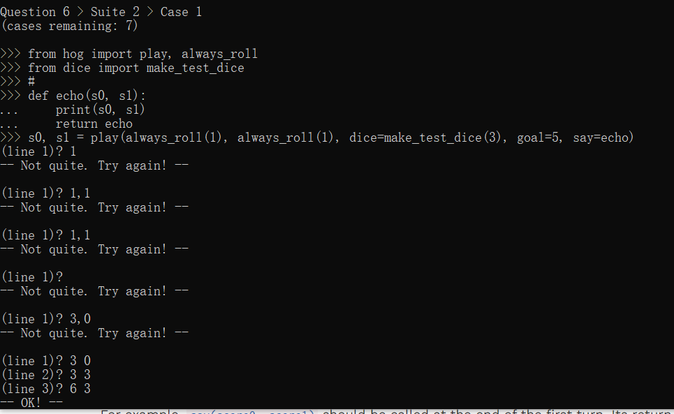

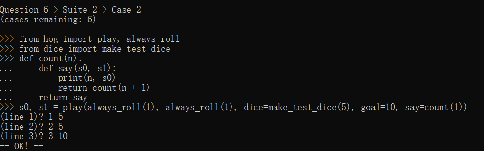

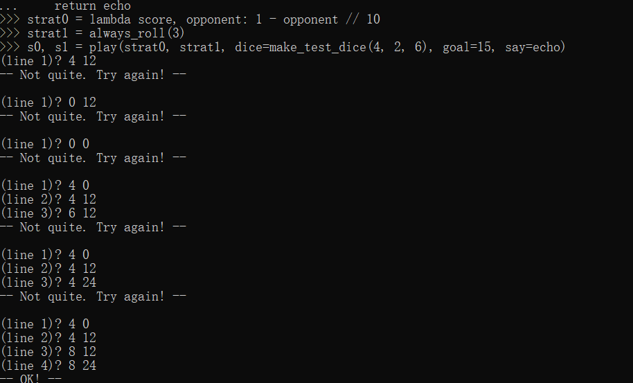

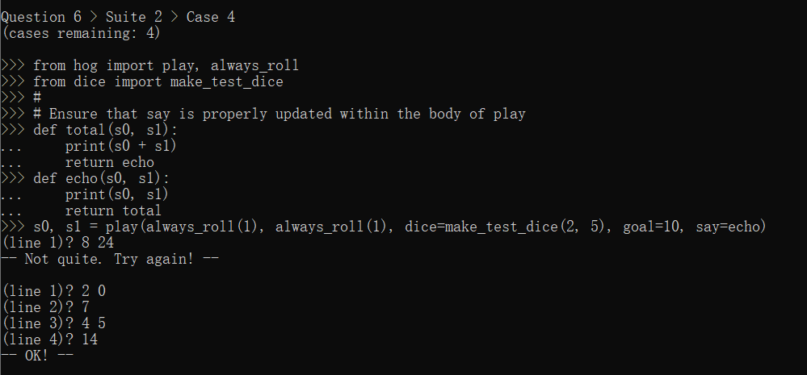

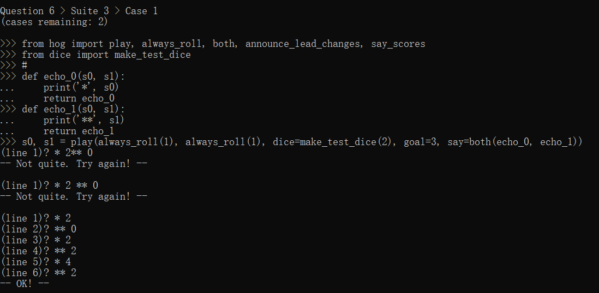

```python
def play(strategy0, strategy1, score0=0, score1=0, dice=six_sided,
         goal=GOAL_SCORE, say=silence):
    """Simulate a game and return the final scores of both players, with Player
    0's score first, and Player 1's score second.
    """
    who = 0  # Who is about to take a turn, 0 (first) or 1 (second)
    # BEGIN PROBLEM 5
    "*** YOUR CODE HERE ***"
    while score0 < goal and score1 < goal:
        if who == 0:
            times = strategy0(score0, score1)
            score0 += take_turn(times, score1, dice, goal)
            if score0>=100:
                break
            if not more_boar(score0, score1):
                who = next_player(who)
        else:
            times = strategy1(score1, score0)
            score1 += take_turn(times, score0, dice, goal)
            if score1>=100:
                break
            if not  more_boar(score1, score0):
                who = next_player(who)
    # END PROBLEM 5
    # (note that the indentation for the problem 6 prompt (***YOUR CODE HERE***) might be misleading)
    # BEGIN PROBLEM 6
        "*** YOUR CODE HERE ***"
        say=say(score0,score1)## 注意要重复赋值say
    # END PROBLEM 6
    return score0, score1
```

## Prob 7


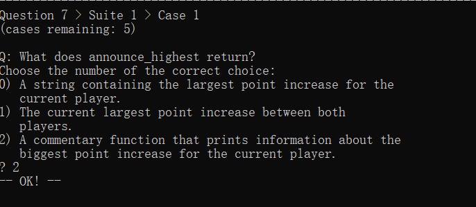

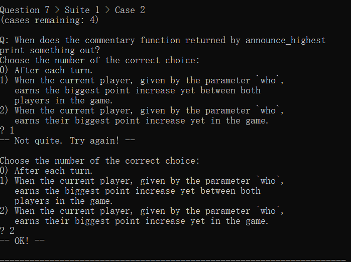

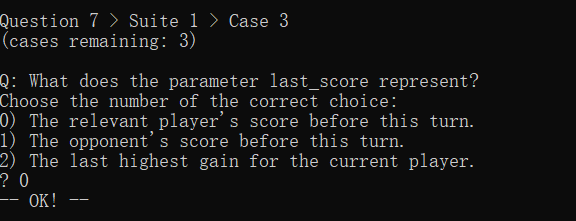

```python
def announce_highest(who, last_score=0, running_high=0):
    """Return a commentary function that announces when WHO's score
    increases by more than ever before in the game.
    """
    assert who == 0 or who == 1, 'The who argument should indicate a player.'
    # BEGIN PROBLEM 7
    "*** YOUR CODE HERE ***"
    def say(score0,score1):
        score=score0 if who ==0 else score1

        increment=score-last_score
        current_high=running_high
        if increment > current_high:
            current_high=increment
            print(f"Player {who} has reached a new maximum point gain. {increment} point(s)!")
        return announce_highest(who,score,current_high)
    return say
    # END PROBLEM 7
```

# Phase 3 Strategy

## Prob 8

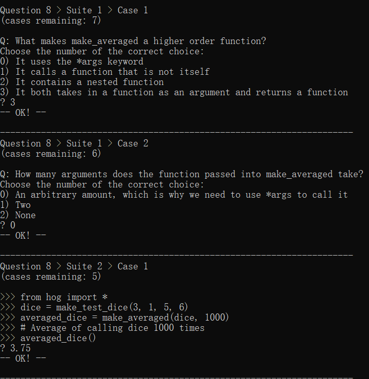

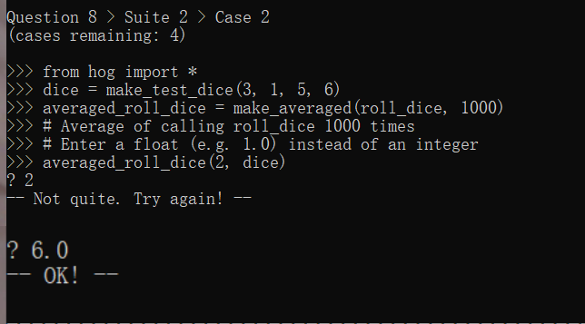

最后一题没有完全理解会进坑，要注意`roll_dice`roll到[3,1]时总点数只有1

```python
def make_averaged(original_function, trials_count=1000):
    """Return a function that returns the average value of ORIGINAL_FUNCTION
    when called.
    """
    # BEGIN PROBLEM 8
    "*** YOUR CODE HERE ***"

    def average(*args):
        total = 0.0
        for i in range(trials_count):
            result = original_function(*args)
            total += result
        return total / trials_count

    return average
    # END PROBLEM 8
```

## Prob 9

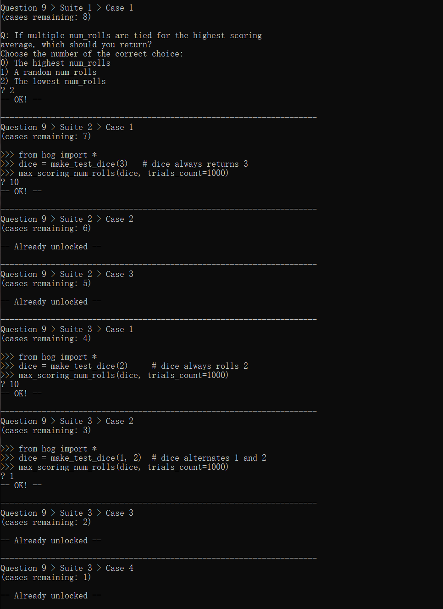

```python
def max_scoring_num_rolls(dice=six_sided, trials_count=1000):
    """Return the number of dice (1 to 10) that gives the highest average turn score
    by calling roll_dice with the provided DICE a total of TRIALS_COUNT times.
    Assume that the dice always return positive outcomes.
    """
    # BEGIN PROBLEM 9
    "*** YOUR CODE HERE ***"
   	max_num = 0  
    max_res = 0 
    for i in range(1, 11):
        get_average = make_averaged(roll_dice, trials_count)
        cur_res = get_average(i, dice)
        if cur_res > max_res:
            max_num = i
            max_res = cur_res
    return max_num
    # END PROBLEM 9
```

## Prob10、11、12

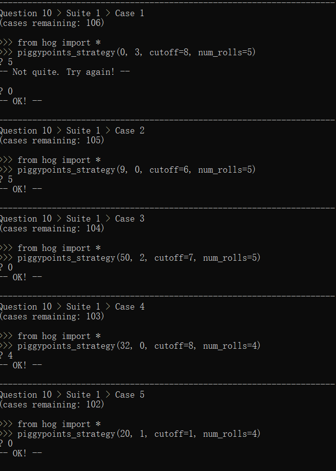

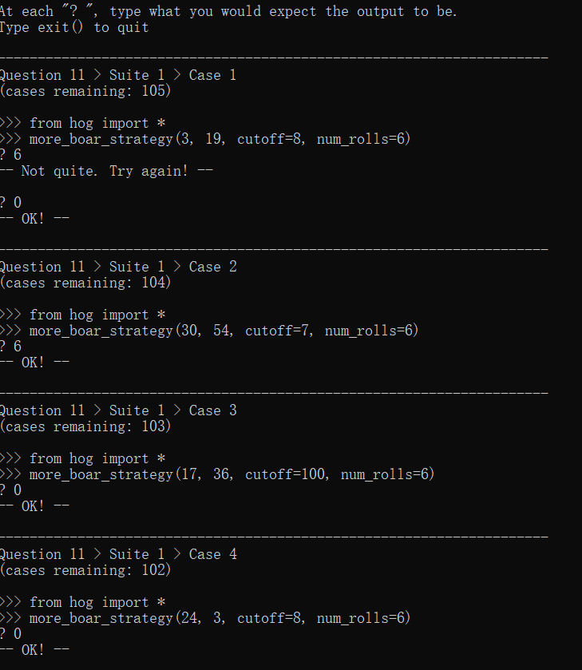

```python
def piggypoints_strategy(score, opponent_score, cutoff=8, num_rolls=6):
    """This strategy rolls 0 dice if that gives at least CUTOFF points, and
    rolls NUM_ROLLS otherwise.
    """
    # BEGIN PROBLEM 10
    if piggy_points(opponent_score) >= cutoff:
        return 0
    else:
        return num_rolls  # Replace this statement
    # END PROBLEM 10
    
def more_boar_strategy(score, opponent_score, cutoff=8, num_rolls=6):
    """This strategy rolls 0 dice when it triggers an extra turn. It also
    rolls 0 dice if it gives at least CUTOFF points and does not give an extra turn.
    Otherwise, it rolls NUM_ROLLS.
    """
    # BEGIN PROBLEM 11
    piggy_point = piggy_points(opponent_score)
    total_score = score + piggy_point
    if more_boar(total_score, opponent_score):
        return 0
    else:
        if piggy_point >= cutoff:
            return 0
        else:
            return num_rolls  # Replace this statement
    # END PROBLEM 11
    
def final_strategy(score, opponent_score):
    """Write a brief description of your final strategy.
    *** YOUR DESCRIPTION HERE ***
    """
    # BEGIN PROBLEM 12
    if score<88:
        return more_boar_strategy(score,opponent_score,cutoff=8,num_rolls=6)
    elif 90 >= score >= opponent_score:
        return piggypoints_strategy(score,opponent_score,cutoff=7,num_rolls=1)
    elif score+piggy_points(opponent_score):
        return 0
    else:
        return 2  # Replace this statement
    # END PROBLEM 12
```

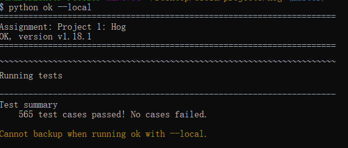
